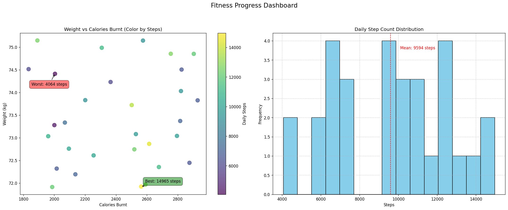

# 🏋️♂️ Fitness Tracker Visualization Dashboard



A dynamic Python dashboard that transforms raw fitness data into actionable insights through powerful visualizations.

## 🌟 Key Features

- **Multi-view Dashboard**: Combines scatter plots and histograms in one view
- **Smart Annotations**: Automatically highlights peak performance days
- **Color-Encoded Metrics**: Steps visualized as color intensity
- **Real Data Ready**: Easily plug in your Fitbit/Apple Health data
- **Professional Styling**: Publication-quality visualizations

## 🚀 Getting Started

### Prerequisites
- Python 3.8+
- Pip package manager

### Installation
1. Clone the repository:
   ```bash
   git clone https://github.com/yourusername/fitness-tracker.git
   cd fitness-tracker
   ```

2. Set up virtual environment (recommended):
   ```bash
   python -m venv venv
   source venv/bin/activate  # Linux/Mac
   venv\Scripts\activate    # Windows
   ```

3. Install dependencies:
   ```bash
   pip install -r requirements.txt
   ```

## 📊 Using with Your Real Data

Replace the sample data generator with your actual fitness data:

1. **CSV Method**:
   ```python
   def generate_fitness_data():
       return pd.read_csv('your_data.csv', parse_dates=['date'])
   ```

2. **API Method** (example with Fitbit):
   ```python
   import fitbit
   def generate_fitness_data():
       # Your API implementation here
       return processed_data
   ```

## 🛠️ Customization Options

### Visual Tweaks
- Change color scheme by modifying the `cmap` parameter
- Adjust bin count in histogram via `bins` parameter
- Modify annotation styles in the `annotate()` calls

### Layout Control
- Change figure size in `plt.subplots(figsize=(W,H))`
- Adjust spacing with `plt.tight_layout(pad=3.0)`

## 🐛 Troubleshooting Guide

| Error | Solution |
|-------|----------|
| Missing assets folder | Run `mkdir assets` manually |
| Matplotlib backend issues | Add `import matplotlib; matplotlib.use('Agg')` |
| Date parsing errors | Ensure dates are in YYYY-MM-DD format |

## 📈 Sample Analysis Walkthrough

1. **Weight-Calorie Relationship**:
   - Look for downward trend (weight loss)
   - Identify outliers (unusual days)

2. **Step Distribution**:
   - Compare your mean to recommended 10,000 steps
   - Note skewness in the histogram

## 🤝 How to Contribute

1. Fork the repository
2. Create your feature branch (`git checkout -b feature/AmazingFeature`)
3. Commit your changes (`git commit -m 'Add amazing feature'`)
4. Push to the branch (`git push origin feature/AmazingFeature`)
5. Open a Pull Request

## 📚 Learning Resources

- [Matplotlib Documentation](https://matplotlib.org/stable/contents.html)
- [Pandas Data Analysis](https://pandas.pydata.org/docs/)
- [Fitness Data Science](https://towardsdatascience.com/tagged/fitness-analytics)

## 📜 License

Distributed under the MIT License. See `LICENSE` for more information.

## ✉️ Contact

For questions or suggestions:
- Your Name - your.email@example.com
- Project Link: [https://github.com/yourusername/fitness-tracker](https://github.com/yourusername/fitness-tracker)

---

**Pro Tip**: Run this weekly to visualize your fitness journey over time! 📅
```
